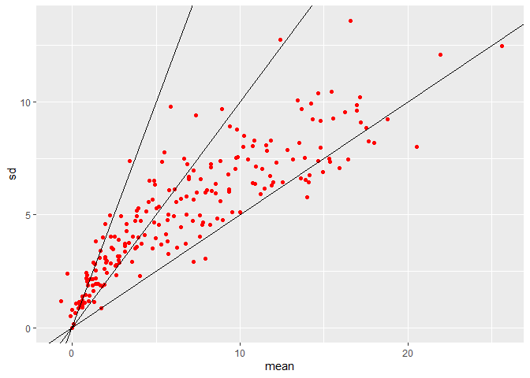

# Topic: Simple evaluation of players' performance

The goal of this analysis is to evaluate if a NFL player makes a stable and important contribution to his team. We can use several basic statistics to summarize the average and variability of a player’s performance. We can compare their performance by visulaization.

In this topic, you will use R to 

1.	calculate mean, standard deviation, and coefficient of variation, which measures variability relative to average state.

2.	make a scatter plot.

## Statistical concepts
The variable in this analysis is the actual score of an NFL player in a week. For each player, there are 17 data points, representing weekly scores in the 2020 season.

### Sample mean
To understand the average performance of one player, we can simply calculate the mean of these weekly scores, which is the sum of all weekly scores ($y_i$), divided by the number of weeks (n). Its math expression is $\bar{y} = \frac{\sum_{i=1}^{n}{y_i}}{n}$.

### Sample standard deviation
Each player is unlikely to score the same point every game. While some players score consistently, others may score differently week to week. To measure the variability, we can reply on standard deviation. Conceptually, standard deviation measures the average distance of each data point from the mean. Its math expression is $s = \sqrt{\frac{\sum_{i=1}^{n}{(y_i - \bar{y})^2}}{n-1}}$. Based on its definition, standard deviation is never negative. The larger the standard deviation, the more variability. In this context, a player with a large standard deviation is indicative of unstable performance.

### Coefficient of variation
An associated statistic is coefficient of variation, which compares variability to mean. Its math expression is $CV = s/\bar{y}$. Since it shows the magnitude of variability relative to the average state, it is particularly useful when you compare more than one variable that has different units. 


# Step 1: Exploring the data
The actual score of each player in the 2020 season was saved in a spreadsheet. To download these data, follow the instruction here. This file has different players in rows and their weekly scores in columns. 


```r
library(dplyr)
library(ggplot2)
```

After loading needed libraries, load the spreadsheet and display the format of the data frame.

```r
### load and process actual fantasy points
# created by webscrapping_weeklyactualpts.py
obspt <- read.csv('D:/fantasyfootball/data2020/2020_weekly_actualpt.csv')

str(obspt)
```

```
## 'data.frame':	724 obs. of  21 variables:
##  $ X       : int  0 1 2 3 4 5 6 7 8 9 ...
##  $ Player  : chr  "Davante Adams" "Josh Jacobs" "Calvin Ridley" "Russell Wilson" ...
##  $ Team    : chr  "GB" "LV" "ATL" "SEA" ...
##  $ Position: chr  "WR" "RB" "WR" "QB" ...
##  $ Week1   : num  41.6 35.9 33.9 31.8 31 30.8 29.1 28.4 28.2 28.2 ...
##  $ Week2   : num  6.6 13.5 29.9 34.4 6.1 19.2 20.8 24.8 34.5 6.3 ...
##  $ Week3   : num  NA 9.3 16.7 36.8 12.3 24.5 23.7 NA 32.2 6.3 ...
##  $ Week4   : num  NA 10.3 0 21.9 26.2 29.6 11.1 NA 25.4 7.8 ...
##  $ Week5   : num  NA 22.5 21.6 25.5 29.3 NA 25.1 NA 18.3 20.9 ...
##  $ Week6   : num  12.1 NA 18.9 NA 14.1 5.8 9.3 NA 16.1 11.8 ...
##  $ Week7   : num  44.6 6.1 19.9 32.9 NA 27.3 24.3 NA 16.4 4.3 ...
##  $ Week8   : num  30.3 12.9 7.2 28.7 5.7 22.5 NA NA 13.5 10.6 ...
##  $ Week9   : num  33.3 13.8 NA 24.1 5.8 28.9 6 37.1 36 1.8 ...
##  $ Week10  : num  18.6 29.6 NA 11.9 20.3 26.4 25.7 NA 29.4 14.3 ...
##  $ Week11  : num  23.6 13.4 14 20.1 32.3 22.7 10.1 NA NA NA ...
##  $ Week12  : num  18.1 5.4 17 14.4 NA 25.6 10.5 NA 16.5 0 ...
##  $ Week13  : num  34.1 NA 15.8 16 21.5 23.5 19.2 NA 30.1 2.4 ...
##  $ Week14  : num  24.5 10.4 26.4 23.1 6.9 30.9 22.6 NA 19.3 6.1 ...
##  $ Week15  : num  11.2 20.4 32.3 13 9.1 18.3 30 NA 37.7 11.4 ...
##  $ Week16  : num  43.2 6.9 17.3 19.9 23.7 26.1 12.8 NA 32.3 4.6 ...
##  $ Week17  : num  16.6 20.9 10.6 18.1 9.7 26 7.5 NA 20.3 4.2 ...
```

```r
# remove X column
obspt <- obspt %>% dplyr::select(-X)
```


# Step 2: Calculating statistics
You could use summary() to look at the five-number summary (i.e. minimum, first quantile, median, third quantile, and maximum) for each player. However, it would be inefficient to apply this function to every player. Following the stpes below, you can calculate the mean, standard deviation, and coefficient of variation for each player and show them in new columns. 


```r
obspt.stats <- obspt %>%
  
  # compute a row-at-a-time
  rowwise() %>%
  
  # add a mean column
  mutate(mean = mean(c_across(Week1:Week17), na.rm = TRUE)) %>%
  
  # add a sd column
  mutate(sd = sd(c_across(Week1:Week17), na.rm = TRUE)) %>%
  
  # add a CV colume
  mutate(cv = sd/mean)
```

Here is the output of the first five players.


```r
head(obspt.stats[,c("Player","mean","sd","cv")])
```

```
## # A tibble: 6 x 4
## # Rowwise: 
##   Player          mean    sd    cv
##   <chr>          <dbl> <dbl> <dbl>
## 1 Davante Adams   25.6 12.5  0.487
## 2 Josh Jacobs     15.4  8.83 0.572
## 3 Calvin Ridley   18.8  9.25 0.493
## 4 Russell Wilson  23.3  7.85 0.337
## 5 Adam Thielen    16.9  9.86 0.583
## 6 Aaron Rodgers   24.3  6.15 0.253
```


# Step 3: Plot statistics 
To compare players in terms of their contribution and consistency, you can visualize their mean on x-axis and standard deviation on y-axis in a scatterplot. Below is the scatterplot of wide receivers. You can also add coefficient of variation to the plot as it is a function of mean and standard deviation. 


```r
# subset wide receivers
obspt.stats.wr <- obspt.stats %>% filter(Position == 'WR')

# scatterplot
ggplot(obspt.stats.wr, aes(x = mean, y = sd)) +
  geom_point(color = "red") +
  
  # add straight lines with known slope
  geom_abline(slope = 0.5) +
  geom_abline(slope = 1) +
  geom_abline(slope = 2)
```

```
## Warning: Removed 19 rows containing missing values (geom_point).
```

<!-- -->

The straight line from top to bottom has coefficient of variation 2, 1, 0.5, respectively. Thanks to these lines, players can be easily categorized by their mean and standard deviation. For example, the players with relatively stable performance are those dots below the bottom line. Note a warning of 19 missing points on the plot. They are not plotted because these players only played one game in the season and therefore didn't have valid sandard deviation.


# Summary
In this topic, you have learned to evaluate a player's performance based on three descriptive statistics and a scatterplot. After evaluation, you can filter out players who had little contribution over time when drafting players for a lineup. 
