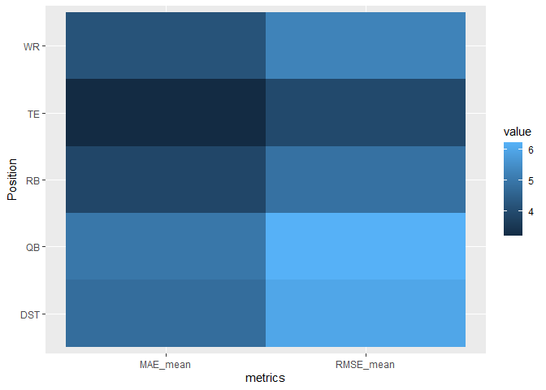
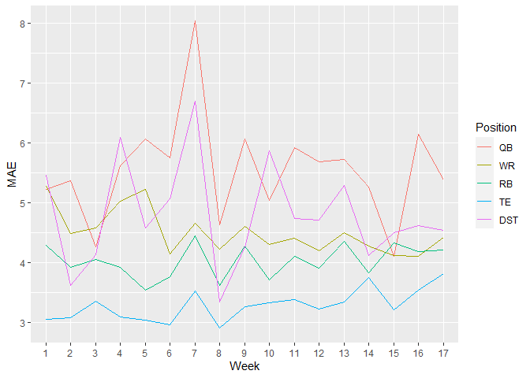

# Topic: Evaluate the performance of predicted scores

Some online platforms such as FantasyPros provide predicted scores of each player before a game so fantasy football players can draft an optimal lineup within the salary cap based on these predictions. However, these predictions are not perfect because of flawed predicting methods and uncontrollable conditions in real life such as player injuries. Imperfect predictions could be costly in rewards as they can lead to suboptimal lineups. Despite drawbacks, predicted scores from online platforms can still be useful as they do positively correlate with actual points sometimes and can save users time and efforts to make their own predictions. In this topic, we will evaluate performance of predicted scores by measuring their deviations from actual scores in different ways. With these measures, we can better 1. understand how predictable of each player and each position and 2. investigate whether predictability changes over time.

In this topic, you will use R to 

1.	calculate several performance metrics.

2.	make a heat map and time series plot to visualize performance metrics.

## Statistical concepts
To evaluate the performance of predicted scores, we need to compare predicted scores to actual scores. There are a variety of metrics, which describe the comparison in one number from different perspectives (Botchkarev 2019). Which one to use depends on the context of questions. Here, you will learn several metrics that are commonly used and easily implemented to fantasy football data. 

## Performance Metrics
All following metrics contain the component of error, defined as the distance between an actual value and a predicted value. In the fantasy football context, error represents the difference between an actual point and a predicted point.  

### Bias
Bias is the mean error. The positive bias represents overestimated prediction on average, whereas the negative bias represents underestimated prediction. Because positive deviation can offset negative deviation, a close-to-zero bias does not imply precise predictions.

### Mean absolute error (MAE)
MAE is the mean of the absolute value of each error. The math form (https://www.statology.org/mean-absolute-error-in-r/). Unlike bias, MAE takes the absolute value of each error before averaging, which can avoid the offset between underestimates and overestimates of predictions. As a result, MAE is never a negative value.

### Mean Absolute Percentage Error (MAPE)
In MAPE, the absolute value of each error is scaled by the actual point, leading to a dimensionless unit. It is a percentage error that describes the magnitude of error relative to the actual point. Because of its dependence on both error and actual point, a MAPE can be high even when the error is low. Although MAPE is commonly used in many fields, it should be used with caution particularly for low-scoring players. Because of its definition, the MAPE is infinite when the actual point is zero.

### Mean Squared Error (MSE)
Evidence by its name, MSE is the mean of the square of errors. Its unit is the square of points. Unlike MAE, which describes error linearly, MSE uses the square to assign more weight to a prediction with a larger error. 

### Root Mean Squared Error (RMSE)
RMSE is the root of MAE.
Except for bias, the other four metrics are never negative values. When they are zero, predictions are identical to observations. The lower the value, the better the prediction. 

The following codes are divided into two parts. In Part I, I calculated metrics for each player using weekly data in the 2019 season and then compared the average metrics over players for each position. I provided calculation of all metrics introduced, and selected MAE and RMSE for visualization purpose. In Part II, I tracked a specific metric, MAE, each week for all positions to see if predictability of the data source changes over time. 

# Exploring the data
First, I read in the spreadsheet that included predicted scores from FantasyPro.com and the actual scores of most players in the entire 2019 season. Using str displays the structure of the data frame that each row represents a player, and the columns from left to right represents the name of a player, his team, position, actual points from Week 1 to Week 17, followed by predicted points from Week 1 to Week 17. 


```r
library(dplyr)  # for pip
library(ggplot2)
library(tidyverse)  # for pivot_longer
library(RCurl)  # link to data saved in googledrive
```

```r
### load data 
link <- "https://drive.google.com/uc?export=download&id=1cVU5r2RQJQi94KK6jDBagFK8hqHAsE5S"
ptdata <- read.csv(link)

# remove unnecessary column
ptdata <- ptdata %>% select(-X)

# display data
str(ptdata)
```

```
## 'data.frame':	526 obs. of  37 variables:
##  $ Player        : chr  "Sammy Watkins" "Christian McCaffrey" "Austin Ekeler" "DeSean Jackson" ...
##  $ Team          : chr  "KC" "CAR" "LAC" "PHI" ...
##  $ Position      : chr  "WR" "RB" "RB" "WR" ...
##  $ Week1         : num  46.8 42.9 39.4 35.4 34.8 33.6 33.4 31.7 31.1 30.7 ...
##  $ Week2         : num  10.9 7.3 23.3 0 21.2 30.9 28.7 12.9 9 16.6 ...
##  $ Week3         : num  11.4 27.8 15.1 NA 2.2 21.3 23.5 25.8 12.7 6.9 ...
##  $ Week4         : num  6.4 33.9 29.2 NA 6.6 26.5 8.6 11.6 8.1 6.2 ...
##  $ Week5         : num  0 47.7 22.3 NA NA 14.4 26.2 41.7 15.8 11.2 ...
##  $ Week6         : num  NA 21.7 5.8 NA NA 30.6 18.2 31.4 16.5 NA ...
##  $ Week7         : num  NA NA 25.5 NA NA 23.3 21.6 17.5 25.6 NA ...
##  $ Week8         : num  9.5 27.5 10.2 NA NA NA NA 27.8 21.9 NA ...
##  $ Week9         : num  13.3 37.6 13.3 1.5 NA 28.6 22.5 19.7 19.4 7.8 ...
##  $ Week10        : num  10.1 26.1 12.8 NA NA 33.4 26.9 NA NA 18 ...
##  $ Week11        : num  4.6 30.1 21.2 NA NA 32.8 31.6 5 15 4.3 ...
##  $ Week12        : num  NA 34.3 NA NA NA 36.3 7.9 19.9 27.4 21.2 ...
##  $ Week13        : num  0 17.2 16.7 NA NA 22.3 23.7 28.9 15.6 1.1 ...
##  $ Week14        : num  9 24.5 31.3 NA 4.8 20.8 17.5 30.1 26.2 2.8 ...
##  $ Week15        : num  9.9 37.5 13.1 NA 4.4 37.1 17.7 18.9 17.9 14.5 ...
##  $ Week16        : num  4.8 32.3 11.9 NA 15 29.8 11.3 10.1 7.3 1.6 ...
##  $ Week17        : num  1.8 22.8 17.9 NA 6 NA 29.6 NA NA 3.5 ...
##  $ Week1_predict : num  10.4 23.1 16.3 9.4 6.8 20 19.1 20.4 21.3 5.9 ...
##  $ Week2_predict : num  19.8 26.6 19.9 12.8 12 20.1 19.6 20.2 20.7 10.9 ...
##  $ Week3_predict : num  18.3 24.4 20.1 NA 14.1 20.9 23 19.6 20.6 14.6 ...
##  $ Week4_predict : num  17.5 23 22.4 NA 12.2 21.2 19.1 20.7 20.9 15.4 ...
##  $ Week5_predict : num  16.9 23.8 17.4 NA NA 20.9 18.2 20.3 21.1 14.7 ...
##  $ Week6_predict : num  NA 25.3 16.2 NA NA 22.3 19.6 20.3 19.6 NA ...
##  $ Week7_predict : num  NA NA 12.5 NA NA 21.8 19.3 20.5 18.9 4.9 ...
##  $ Week8_predict : num  7.8 22.3 13.8 NA NA NA NA 22.7 20.4 NA ...
##  $ Week9_predict : num  9.9 24.6 15 8 NA 19.4 21.2 20 18.9 10 ...
##  $ Week10_predict: num  12 25 13.5 NA NA 24.5 18.9 NA NA 11.4 ...
##  $ Week11_predict: num  12.9 27.3 13.7 NA NA 23.4 20.8 20.1 18.1 12.6 ...
##  $ Week12_predict: num  NA 24.2 NA NA 5.8 24.1 17.2 20.3 NA 11.1 ...
##  $ Week13_predict: num  11.5 27.4 12.5 NA 6.5 23.6 19.3 17 15.1 12.2 ...
##  $ Week14_predict: num  9.8 26.4 13.7 NA 8.1 22.4 18.4 19.6 17.8 9.6 ...
##  $ Week15_predict: num  9.8 25.2 15 NA 9.1 23.2 18.9 20.2 19 12.4 ...
##  $ Week16_predict: num  10 24.6 15.8 NA 9.3 25.4 18.9 21.3 20.3 12.3 ...
##  $ Week17_predict: num  10.1 26.2 18.8 NA 13.8 NA 19.7 13 7.9 4.6 ...
```

# Part I
I created a function to calculate the five metrics for a player. Then, I applied the function to every player using a loop. 


```r
### function to calculate metrics for a player
performance_metrics_player <- function(df){
  
  # actual point
  obs <- df %>%
    select(Week1:Week17) %>%
    
    # lengthen data
    pivot_longer(starts_with('Week'), 
                 names_to = "obs",
                 values_to = "point")
  
  # predicted point
  pre <- df %>%
    select(Week1_predict:Week17_predict) %>%
    pivot_longer(starts_with('Week'), 
                 names_to = "predict",
                 values_to = "point")
  
  # exclude NaN point
  obspredict.nonan <- na.omit(cbind(obs$point, pre$point))
  
  # Bias
  biasi <- mean(obspredict.nonan[,1]-obspredict.nonan[,2])
  
  # Mean Absolute Error
  maei <- mean(abs(obspredict.nonan[,1]-obspredict.nonan[,2]))
  
  # Mean Absolute Percentage Error
  mapei <- mean(abs((obspredict.nonan[,1]-obspredict.nonan[,2])/obspredict.nonan[,1]))*100
  
  # Mean Squared Error
  msei <- mean((obspredict.nonan[,1]-obspredict.nonan[,2])^2)
  
  # Root Mean Squared Error
  rmsei <- sqrt(msei)
  
  pm <- c(maei, mapei, rmsei)
  return(data.frame(bias = biasi, MAE = maei, MAPE = mapei, MSE = msei, RMSE = rmsei))
}

### calculate metrics for each player
pm.df <- data.frame(Player = ptdata$Player, Position = ptdata$Position)
pm <- c()

# apply function to each player
for (i in 1:nrow(ptdata)){
  playeri <- ptdata[i,]
  pm <- rbind(pm, performance_metrics_player(playeri))
}
pm.info <- cbind(pm.df, pm)

head(pm.info)
```

```
##                Player Position      bias       MAE      MAPE       MSE
## 1       Sammy Watkins       WR -2.728571  8.671429       Inf 155.45571
## 2 Christian McCaffrey       RB  4.487500  9.287500  41.04193 132.24750
## 3       Austin Ekeler       RB  3.275000  6.787500  37.78079  83.57500
## 4      DeSean Jackson       WR  2.233333 15.100000       Inf 294.03000
## 5           John Ross       WR  1.200000  9.525000 136.64772 145.99000
## 6       Lamar Jackson       QB  5.900000  7.153333  24.18944  70.74067
##        RMSE
## 1 12.468188
## 2 11.499891
## 3  9.141936
## 4 17.147303
## 5 12.082632
## 6  8.410747
```

Above is the five metrics of the first six players in the data frame. Unlike the other five players, there is a negative bias for Sammy Watkins, indicating an overestimated prediction on average. His MAE is an infinite value due to a zero point in the Week 5 game. Although John Ross’ prediction had the bias closest to zero, it had the fourth largest MAE among the six players. The closest to zero bias results from a cancellation between positive and negative errors. Lamar Jackson’s prediction had the largest bias but the smallest RMSE, suggesting the absence of large errors.

Online platforms use different information in their predictions for different positions (insert reference). For example, …. To investigate if the prediction in one position outperforms others, we calculated the mean metric over players for each position. 


```r
### calculate mean MAE and RMSE for each position
pm.qb <- pm.info %>% 
  filter(Position == 'QB') %>%
  summarise(MAE_mean = mean(MAE, na.rm = TRUE), RMSE_mean = mean(RMSE, na.rm = TRUE)) %>%
  mutate(Position = 'QB')
pm.wr <- pm.info %>% 
  filter(Position == 'WR') %>%
  summarise(MAE_mean = mean(MAE, na.rm = TRUE), RMSE_mean = mean(RMSE, na.rm = TRUE)) %>%
  mutate(Position = 'WR')
pm.rb <- pm.info %>% 
  filter(Position == 'RB') %>%
  summarise(MAE_mean = mean(MAE, na.rm = TRUE), RMSE_mean = mean(RMSE, na.rm = TRUE)) %>%
  mutate(Position = 'RB')
pm.te <- pm.info %>% 
  filter(Position == 'TE') %>%
  summarise(MAE_mean = mean(MAE, na.rm = TRUE), RMSE_mean = mean(RMSE, na.rm = TRUE)) %>%
  mutate(Position = 'TE')
pm.dst <- pm.info %>%
  filter(Position == 'DST') %>%
  summarise(MAE_mean = mean(MAE, na.rm = TRUE), RMSE_mean = mean(RMSE, na.rm = TRUE)) %>%
  mutate(Position = 'DST')

# combine all positions
pm.all <- rbind(pm.qb, pm.wr, pm.rb, pm.te, pm.dst) %>%
  
  # lengthen data for plotting
  pivot_longer(cols = c("MAE_mean","RMSE_mean"), names_to = "metrics", values_to = "value")
```


Following calculation, we used a heat map to make a comparison where the darker the color the lower the metrics, the better the predictability. For visualization purpose, we chose two metrics, MAE and RMSE. 


```r
### plot a heat map to compare metrics between positions
ggplot(pm.all, aes(x = metrics, y = Position, fill = value)) +
  geom_tile() 
```

<!-- -->

Among all positions, the prediction of tie ends appears to be the best in both metrics, whereas that of quarter backs appears to be the worst.

# Part II

A following question is whether the predictability of each position varies week by week. To answer this question, we created a function to calculate MAE for players in one position of a week. We then applied this function to each position every week and tracked the metric throughout the whole season.


```r
### function to calculate metrics for a position in a week
performance_metrics_week <- function(X,output){
  
  # X has position and week information
  ipos <- X[1]
  iwk <- X[2]
  
  # subset players for a certain position
  posi <- ptdata %>%
    filter(Position == ipos)
  
  # subset a certain week
  obspredict <- cbind(posi[paste0('Week',iwk)], posi[paste0('Week',iwk,'_predict')]) 
  obspredict.nonan <- na.omit(obspredict[1:2])
  
  # calculate MAE using players for a certain position in a certain week
  maei <- mean(abs(obspredict.nonan[,1]-obspredict.nonan[,2]))
  return(maei)
}

# loop through weeks and positions
iwk <- as.character(c(seq(1,17)))
ipos <- c('QB','WR','RB','TE','DST')

# create a data frame from a combination of positions and weeks
poswk <- expand.grid(ipos,iwk)

# name columns
names(poswk)<-c("ipos","iwk")

# apply the function to each position-week combination
mae_all <- apply(poswk, 1, performance_metrics_week)

# attach MAE to position-week information
mae_poswk <- cbind(poswk,mae_all)
```

Unlike Part I that used a for loop, Part II used the ‘apply’ function to carry out the custom function to each row of a data frame. There are several ways to do this work – some take less time while others may take longer time. Readers can explore different ways to see if same results are obtained.


```r
### plot a heat map to compare metrics between positions
ggplot(mae_poswk, aes(x = iwk, y = mae_all, colour = ipos, group = ipos)) +
  geom_line() +
  xlab("Week") +
  ylab("MAE") +
  labs(color = "Position")
```

<!-- -->

The time series plot shows MAE of each position over 17 weeks. Throughout the season, tie end predictions remain to be the best. Although the quarter back prediction is the worst in general, it is not always the worst. The MAE of the quarter back prediction is lower than the defense prediction in Week 4, 10, and 15. MAE of each position varies week to week and displays large swing sometimes. For example, the MAE of the previous week could be as twice as this week.

# Summary

In summary, you learned how to calculate commonly used performance metrics and apply them to fantasy football data for different questions. The results can help evaluate the predictability of the data that hopefully can benefit your decision making in drafting players.  The codes can be applicable to another data source or another reason, which could result in different conclusions about performance. 

Since the prediction provided from online platforms has noticeable errors, our next topic is to explore approaches to improve these predicted points and/or create our own prediction.

### Reference
Botchkarev 2019: A New Typology Design of Performance Metrics to Measure Errors in Machine Learning Regression Algorithms, Interdisciplinary Journal of Information, Knowledge, and Management, 14, 45-76, https://doi.org/10.28945/4184
